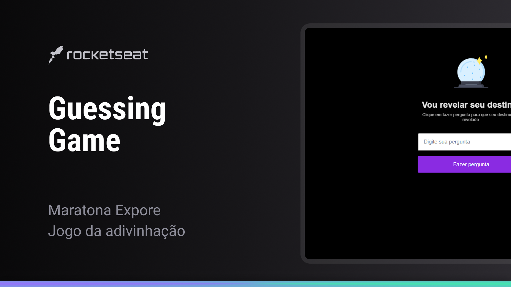

<h1 align="center">
  
</h1>

<p align="center">
  <a href="#evento">Evento</a>&nbsp;&nbsp;&nbsp;|&nbsp;&nbsp;&nbsp;
  <a href="#rocket-tecnologias">Tecnologias</a>&nbsp;&nbsp;&nbsp;|&nbsp;&nbsp;&nbsp;
  <a href="#laptop-projeto">Projetos</a>&nbsp;&nbsp;&nbsp;
  |&nbsp;&nbsp;&nbsp;
  <a href="#bookmark-layout">Layout</a>&nbsp;&nbsp;&nbsp;
</p>




<br>

## Evento

Evento NLW09 - eSports pela @Rocketseat.

Usando o poder do Html, CSS e o JavaScript.

## :rocket: Tecnologias

Esse projeto foi desenvolvido com as seguintes tecnologias:

-  [HTML](https://developer.mozilla.org/pt-BR/docs/Web/HTML)
-  [CSS](https://developer.mozilla.org/pt-BR/docs/Web/CSS)
-  [JavaScript](https://developer.mozilla.org/pt-BR/docs/Web/JavaScript)


## :laptop: Projeto

- Jogo de Adivinhação

### HTML
- HyperText Markup Language

- Hiper Texto?
- Marcação
  - tags
  - atributos
- Linguagem
  - maneira de escrever

### CSS

- Apresentação visual para o cliente
- Estilos para o HTML
- Cascading Style Sheets
  - Folha de Estilo em Cascata

### Declaração
- Seletor
- Propriedade e Valor

### Conceitos
- Cascata
- Especificidade
- Box Model
- Display block vs inline


### imagem bola de cristal
https://gist.githubusercontent.com/maykbrito/0acdf4ce919838ffed50915a31fc5b23/raw/6f4dd01ec3116428ec4c99255944cb9ac7927590/cristal-ball.svg

### JavaScript

```js
// 1. Variáveis
// let estaChovendo = true
// const meuNome = "Mayk"


// 2. Tipos de Dados 
  // String
  // ""
  // ''
  
  // Number
  // 12 - Integer (+ -)
  // 3.2 - Float (+ - )

  // Boolean
  // true ou false
  // const maiorDeDezoito = false

  // undefined - indefinido


// 3. Operadores
  // Atribuição (ex: =)
  // atribui valor
  // let n1 = 12
  // let n2 = 3 

  // Aritméticos (ex: * / + - )
  // calculos matemáticos simples

  // Concatenação de String (+)

  // Comparação (ex: > < == )
  // transforma a expressão em true ou false
  // const maiorQue = 1 > 2 // false
  // const igualA = 1 == 1 // true

// 4. Condicional (if/else)
  // const idade = 18
  // const maiorDeDezoito = idade >= 18 

  // if(maiorDeDezoito) {
  //   alert("Pode tirar carteira de motorista")
  // } else {
  //   alert("Não pode tirar")
  // }

// 5. Estrutura de dados
  // Array - Vetor - Lista
  // Array -----         0     1    2  3
  // const temperaturas = [23.3, 32.2, 1, 5]

  // Object
  // const pessoa = {
  //   nome: "Mayk",
  //   idade: 38,
  //   filhos: ["K", "E", "J", "L", "G"]
  // }
  // console.log(pessoa.filhos[3])

// 6. Function
  // 1. Criação 
  // function nomeDaFuncao() {
  //   console.log('código da função')
  // }

  // 2. Execução
  // nomeDaFuncao()


  // Parâmetros
  // function soma(a, b) {
  //   console.log(a + b)
  // }
  // soma(34, 45)
  // soma(90, 54)

  // Retorno
  // function soma(a, b) {
  //   return a + b
  // }

  // const multiplica = soma(2, 2) * 4
  // console.log(multiplica)

  // console.log(soma(2, 2))


// 7. Extensões da linguagem (ex.: Math, Date ...)

// Math.random()
// Math.floor(1.2)
// Math.ceil(1.2)

// 8. DOM - Document Object Model 
  
  // window
  // window.alert("alerta")
  // document
  // document.write("texto")
  // manipular elementos
  // document.documentElement.style.background = "black"
```

## :bookmark: Layout

Projeto Jogo de adivinhação - Você pode visualizar o layout do projeto no formato através [desse link](https://www.fronteditor.dev/gists/3abcba9e90e2763ab4d2689c9897ebbd/view).